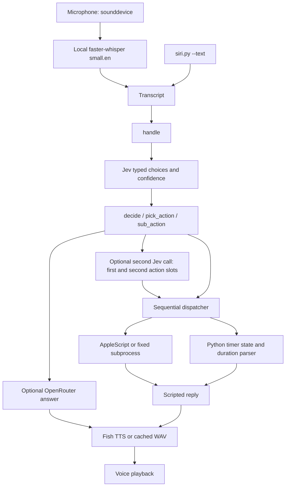
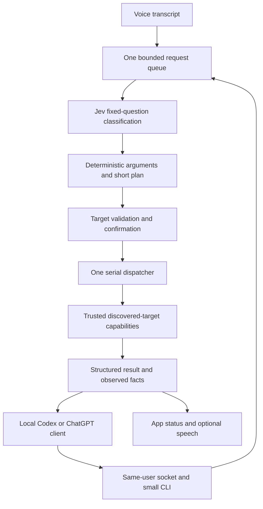

# Hey Jev: what it controls, and how to grow it

Status: discussion checkpoint, 2026-09-24. Major implementation is paused at Johnny's request. This document describes the actual source, then proposals. It does not claim the proposed capabilities exist.

## The short answer

Hey Jev currently understands flexible wording for a small fixed collection of actions. It is not yet a general computer-use agent. Python is not the limiting factor: the missing pieces are broader action adapters, argument extraction, target selection and a reliable step runner.

We do **not** need to hardcode every sentence. We do need to implement trustworthy capabilities. A reusable “open app” capability can accept many installed apps; “navigate browser” can accept many URLs; a recipe can combine them. Finding an unfamiliar button or deciding what a new website means is a separate semantic/visual problem.

Two co-equal foundations govern the fork: discoverable reusable Mac capabilities and a text/programmatic bridge for Codex/ChatGPT to command the running app. First prove a single existing app-open action through both voice and bridge; then grow discovered targets and Johnny's Safari sequence with URL readback and honest failure reporting. Keep Jev as a fixed-question classifier and Python as the deterministic executor. General visual computer use is outside the core design.

## Actual path through the app



1. In the GUI, `NSEvent` watches right Option and sends press/release events to a Python queue. Terminal push-to-talk uses `pynput`. `Recorder` captures mono 16 kHz input through `sounddevice`.
2. Push-to-talk transcribes after release. Wake mode segments speech using a volume threshold and silence; local Whisper transcribes those segments. A regular expression accepts “Hey Jev” and several similar transcriptions. Saying the wake phrase alone arms a six-second follow-up window.
3. `run_voice_assistant()` calls `handle(transcript)`. `--text` calls the same `handle()` directly, skipping Whisper and microphone startup. A text invocation does not start the persistent timer-alert loop, so it is not equivalent to sending a command into the running app.
4. `jev()` sends the transcript and predefined questions to OpenRouter `/api/alpha/decisions` (`typesafe/jev-1.13`) or TypeSafe `/v1/systemone` (`jev-latest`). It returns typed choices, rubric scores and yes/no probabilities, not arbitrary action code or URL/text strings.
5. `decide()`, `pick_action()` and `sub_action()` convert those results into internal action tuples. Most action confidence checks use 0.65; target selection can use 0.5. A compound request causes a second Jev call with FIRST/SECOND copies of the fixed questions.
6. The dispatcher calls `ACTIONS[action](argument)` or `run_timer(action, original_text)`. Timers use deterministic duration/reminder parsing from the transcript. Other arguments currently come from fixed choices.
7. Scripted text describes the result, or a deeper-answer request generates one short sentence. Fish creates a WAV, which is cached. The committed baseline plays it with `afplay`; the uncommitted UI work switches spoken playback to native `NSSound` for live independent gain.

Source anchors: `siri.py`: `QUESTIONS`, `jev`, `ACTIONS`, `parse_duration`, `decide`, `split_actions`, `handle`, `Recorder`, `run_voice_assistant`, `main`. `assistant_ui.py`: key event monitors and controls queue.

## Exact current inventory and mechanisms

| Command family | Supported arguments/behavior | Actual mechanism | Current verification/limit |
| --- | --- | --- | --- |
| Open/quit app | Spotify, Slack, Google Chrome, Visual Studio Code, Finder, Safari, Messages, Notes | Open: `open -a` subprocess. Quit: application AppleScript via `osascript` | Open polls application `is running` for up to five seconds; it does not raise if that wait expires. Quit has no state readback. No installed-app discovery. |
| Mac volume | Up/down by 20; mute/unmute; silent/quiet/medium/loud/max = 0/25/50/75/100 | Standard Additions AppleScript volume commands | Relative changes read initial volume; no post-write verification. Arbitrary exact percentages are not supported. |
| Spotify volume | Same levels and 20-point changes; unmute sets 50 | Spotify AppleScript `sound volume` property | Does not restore previous volume after mute; no post-write readback. |
| Media | Play, pause, next, previous | Spotify AppleScript | **Spotify only**, not system-wide media keys. Play retries 12 times with 0.5-second waits until `player state` says playing. Other actions have no completion readback. |
| Dark mode | On/off/toggle | `System Events` appearance preferences through AppleScript | No UI clicking; no readback after setting. |
| Lock | Lock screen | `System Events` sends Control-Command-Q | This is keyboard automation, dependent on appropriate permissions. No lock-state verification. |
| Sleep | Sleep now | Fixed `pmset sleepnow` subprocess | No completion readback. |
| Timer | Set duration; check soonest; cancel most recently created; cancel all | Python list/lock, number-word normalization and regex duration parsing | In-memory only, lost on quit. Timer loop checks every 0.25 seconds. Supports seconds/minutes/hours and several number phrases, not arbitrary calendar scheduling. |
| Reminder | Timer plus reminder text after “to” | Same parser; optional OpenRouter request writes label/alert; Fish pre-renders it | Existing extraction lowercases and normalizes number words, so it is **not** an exact-text parser suitable for arbitrary typing. |
| Timer completion | Chime, spoken alert and UI state | `afplay` Glass sound, then Fish voice | No external notification delivery guarantee. |
| Conversation/questions | Scripted chat or optional short generated answer | Fixed reply strings or OpenRouter chat completions | Generated answers are not executed as commands. |

`osascript` and other commands are invoked as argument lists, without `shell=True`. Current application names and most command arguments come from fixed tables. This is a useful boundary to preserve when adding free-form text and URLs.

## Why Safari opened but did not navigate

The current schema knows `app=safari` and `app_action=open`. It has no navigation action, URL field, browser tab target or page-readiness check. The second compound slot can only choose from the same existing actions. It cannot represent “go to google.com.” A larger or different answer model alone will not add that capability.

There is another reliability issue: if splitting fails to produce two actions, `split_actions()` falls back to collecting confident actions by fixed target order. The dispatcher catches an action error and keeps going. If one of two actions succeeds, it can still say “Done, both of them.” Those behaviors must change for a dependable sequence. They are more urgent than a sophisticated planner.

## How far this architecture can reach

| Capability | Practical route | What still needs implementation |
| --- | --- | --- |
| Open any installed app | Discover installed apps and resolve names to stable bundle IDs; use Launch Services or `open` | Candidate lookup, ambiguity handling and launch verification. No need to add every app to source manually. |
| App-specific operations | Native app scripting dictionary, URL scheme, supported CLI or API | One adapter per meaningful capability. Apps expose different operations. |
| Menus/buttons | macOS Accessibility API; sometimes System Events UI scripting | Read the target app's accessible elements, resolve a unique role/name, execute supported action and read back state. Some custom controls expose little or nothing. |
| Type specified text | Set a supported accessibility text value, or controlled keystrokes/paste into an explicitly identified field | Focus/target checks, Unicode handling, secure-field exclusions and text readback. Blind typing into whichever app is frontmost is not robust. |
| Navigate Safari | Safari AppleScript tab/document URL property | Validated HTTP(S) argument, explicit tab policy, readiness timeout and observed URL. Redirects need sensible success handling. URL readback does not prove a page fully rendered. |
| Fill a known website field | Safari DOM JavaScript with a known selector, or accessible field targeting | Site-specific target and postcondition. Safari JavaScript from Apple Events is a separate user-controlled developer permission. |
| Search a website | Known search URL template or a tested field-and-submit recipe | Query encoding and result/URL verification. A URL recipe is often simpler than clicking a form. |
| Click an unfamiliar website's “right” control | Semantic reasoning over DOM/accessibility state, or a vision-driven loop | A separate observation/action system. Jev can rank supplied choices, but cannot choose elements it has never been shown. |
| Arbitrary multi-step task | Planner over known capabilities, with observation between steps | Target/state model, bounded retries, interruption, confirmation and failure reporting. Not achieved by adding more `if` statements alone. |

The installed Safari scripting dictionary advertises tabs, URL properties, `do JavaScript` and `search the web`. That proves an API surface exists, not that this app has permission or that any particular website interaction is verified. No browser permission was changed during this inspection.

Apple references: [Accessibility elements](https://developer.apple.com/documentation/applicationservices/axuielement_h), [Safari developer settings](https://developer.apple.com/documentation/safari-developer-tools/developer-settings). Installed evidence: `/Applications/Safari.app/Contents/Resources/Safari.sdef`.

## Must every command be hardcoded?

**No. Implement capabilities once; supply arguments and compose recipes.** The existing `ACTIONS` dictionary is already a small action registry. Start by extending it with a few metadata fields rather than introducing an agent framework.

A capability needs:

- A stable action name and typed arguments, such as `browser.navigate(url)` or `app.open(bundle_id)`.
- Preconditions, such as “Safari has a usable tab” or “the named field exists exactly once.”
- One executor using a native API or a fixed, safely parameterized script.
- A timeout and postcondition, with a result of completed, failed, unsupported or awaiting confirmation.
- An effect classification: ordinary reversible control versus sending, purchasing, deleting or another consequential action.

A recipe is data composing these capabilities. Illustrative only; no recipe runner exists yet:

```json
{
  "name": "Open a website in Safari",
  "arguments": {"url": "http_url"},
  "steps": [
    {"action": "app.open", "bundle_id": "com.apple.Safari"},
    {"action": "browser.navigate", "browser": "safari", "url": "$url"}
  ]
}
```

For noncoders, Johnny can describe or demonstrate a workflow and have Codex create a reviewed recipe. A later small form could expose supported steps and arguments. Do not build that editor before a handful of recipes prove useful. Recipes must not contain arbitrary Python, shell or AppleScript supplied by speech; trusted adapters own executable code.

Jev can select a capability or recipe from known candidates and score ambiguity. Deterministic extraction handles URLs and explicitly delimited text. Generative command planning is outside the current design. If the deterministic grammar cannot extract arguments unambiguously, ask for a clearer command rather than introducing an LLM planner. The optional deeper-answer LLM remains separate from control and must not rewrite command arguments. Whisper itself can mishear speech, so “exact” voice text means preserving the transcript and allowing review where exact wording matters; a typed bridge can preserve bytes directly.

For consequential steps, show the concrete target/action/content for confirmation before executing. Ordinary app opening and navigation should not acquire unnecessary confirmation prompts. Unknown/ambiguous targets should return a specific question or failure, not a guessed click.

## Foundational running-app interface (proposed)

One running Hey Jev instance owns the microphone, timers, provider state and dispatcher. Voice transcripts and local typed/API text requests converge **before** Jev classification and deterministic planning. The bridge does not accept arbitrary executable code or provide a privileged direct-executor route. A Codex/ChatGPT client needs local tool access to call it; no remote service or duplicate agent framework is implied.



Agree the smallest contract before broad discovery work:

- Request: request ID and bounded command text; origin identifies voice or local client for presentation, never authority.
- Internal action: stable action name, typed arguments, resolved target and deadline. Trusted adapters own effects, preconditions and verification.
- Result: request ID, state (`completed`, `failed`, `unsupported`, `needs_clarification`, `needs_confirmation`), concise detail and observed facts; include failed step when sequences arrive. Receipt/queue acknowledgement is distinct from completion.

Use simple Python data structures. A Unix socket in a same-user private directory, restrictive file permissions and peer-user verification provide the local boundary. Bound payloads, queue capacity and waits; reject malformed/unauthorized callers. The CLI connects to the running app and reports unavailable rather than launching another engine. Existing one-shot `--text` must not be mistaken for shared running state.

Serialize commands through one dispatcher, coordinating existing timer/state locks without blocking the UI or timer loop. Voice and text receive the same extraction, target validation, readiness checks and failure semantics. Consequential-action confirmation remains tied to the concrete pending action; programmatic input cannot self-authorize it. A disconnected or timed-out caller must not automatically replay a possibly completed action. Clarification and confirmation can initially remain in the app, with their pending state returned to the caller.

### Selected transport and client contract

Use a small Python standard-library Unix domain stream socket server **inside the existing app process**, plus a tiny `jevctl` CLI. This is the selected architecture. A loopback HTTP service adds port/token lifecycle without helping the first local caller; an MCP adapter may later wrap this exact client if needed, but is not part of the first slice. Do not introduce another daemon or model runtime.

The CLI accepts a `command` subcommand with `--text` or `--text-file` (UTF-8, `-` for stdin), plus `--request-id` and a bounded wait option. Codex can use its current `exec_command` tool to run the installed client by absolute path, passing a text-file path when quoting arbitrary text would be awkward. Pass subprocess arguments as arrays when calling from Python. Never construct executable shell/AppleScript from the request text. ChatGPT needs an equivalent authorized local execution tool; the socket is not accessible from a cloud-only chat by itself.

Use one UTF-8 JSON object followed by newline per request/response, protocol version `1`, no streaming protocol in the first slice. Proposed request:

```json
{"v":1,"id":"caller-generated-unique-id","op":"command","text":"open Safari"}
```

Proposed terminal response:

```json
{"v":1,"id":"caller-generated-unique-id","state":"completed","steps":[{"action":"app.open","state":"completed","target":{"bundle_id":"com.apple.Safari"},"observed":{"running":true}}]}
```

The response may instead report `failed`, `unsupported`, `needs_clarification` or `needs_confirmation`, with a short machine-readable error code and human detail. Per-step results use the same states. Request status additionally supports `queued` and `running`; these are not success. Unknown protocol versions, operations and fields are rejected. Preserve command text exactly after decoding UTF-8; normalize only a separate comparison copy.

**Text versus typed actions:** v1 external commands accept text only, so both voice and CLI enter before the same Jev classification/planning. The typed action contract is internal to the trusted dispatcher, not a second public execution endpoint. A future typed entrypoint would require a concrete measured need and the identical resolver, validation, permission, confirmation and execution path; it must not silently bypass those gates. A client cannot supply arbitrary target handles, executable code or `confirmed=true` to skip review.

### Bounds, cancellation and replay

Initial explicit limits: 16 KiB per request, 64 KiB per response, 8 queued commands, 5 seconds to finish sending one request, 30 seconds queued before expiry, and a 60-second client wait by default. These are conservative starting values to tune from trials. Native adapters have bounded waits (start with 10 seconds for app launch); report timeout honestly when the native effect is uncertain. Reject an overloaded queue with `busy` rather than opening unbounded worker threads. A tiny bounded socket worker accepts/validates requests and hands them to the existing serial engine worker; it must not run Jev or native actions itself. UI updates remain on the main thread, and timer alerts continue under the existing state locks.

Keep a bounded in-memory request ledger (for example 256 records for 10 minutes). Register each ID before queueing. Same ID and same payload returns existing status/result; same ID with different payload is an error. Never evict a queued/running entry to admit another request. Add `status` and `cancel` operations taking the request ID, without another classification call. Cancellation can remove queued work or prevent the next step; it cannot promise rollback or interrupt an already-issued native effect. A disconnect does not cancel execution. Client wait expiry prints structured pending/unknown status and exits without resubmitting. A caller may query status using the same ID, never retry the command blindly with a new ID.

The ledger is not durable. After app restart, an unknown previous ID means outcome unknown, not safe-to-replay. Include a per-start instance ID in responses so callers can detect this boundary. Do not claim exactly-once behavior across crashes. For a consequential action, `needs_confirmation` identifies a concrete pending action for review in the app; v1 confirmation stays in that UI. Resume only after current target/preconditions are revalidated. Same-user authentication establishes caller identity, not permission to bypass action policy.

### Socket lifecycle and same-user boundary

Use a per-user app-support directory, for example `~/Library/Application Support/Hey Jev/run`, owned by the current UID with mode `0700`; the socket has mode `0600`. Verify the peer UID using macOS local-socket peer credentials (`getpeereid` or its supported equivalent). File permissions and peer validation are both required; do not silently omit peer checks when an API binding is unavailable. No credentials travel in payloads or CLI arguments.

At startup, acquire a standard OS file lock in that private directory before binding. If another app owns the lock, the second instance must not create another dispatcher/server. Connect only to an owned socket in the expected directory, reject symlinks/unexpected file types/ownership, and fail closed on permission errors. If a stale socket remains after a crash, remove only that owned socket after obtaining the exclusive lock and confirming no live listener. Never unlink a live endpoint or arbitrary directory content. Bind/listen once engine initialization is ready; return an explicit unavailable/busy result during startup rather than silently spawning another engine.

On quit, stop accepting requests, mark queued requests cancelled, allow the current bounded native call to settle where possible, then close and unlink only this instance's socket and release the lock. If shutdown/crash prevents a terminal reply, the caller receives unknown outcome. Keep request text out of routine logs; log IDs, state and timing without credentials or dictated private content.

### First slice and evidence

Build only the CLI/socket envelope, bounded queue/result ledger and one shared `app.open` action first. Johnny runs the app once, says “open Safari,” then sends the same words with `jevctl command --text-file ...`; both should use one classifier/dispatcher and verify the same app identity. A second simultaneous request queues rather than overlapping or initializing another engine. Confirm timer state survives both inputs, a bad target returns an honest result, a repeated ID does not execute twice, a client timeout does not replay, and quit/relaunch handles a stale socket safely. Leave one small offline protocol/queue check plus the existing provider tests; do not build a large framework or test matrix before this trial.

Measure cold CLI startup, socket/queue overhead, classification calls and latency, native execution/readback, total observed completion, and actual provider token/cost data where available. Compare identical successful actions against the one-shot `--text` route and a measured Codex computer-use baseline. The persistent design avoids reinitialization and shares live state; it does not inherently reduce Jev inference latency or prove lower total cost. Current `--text` skips microphone/Whisper but creates a fresh process and lacks the live timer loop, shared queue and correlated results, so it cannot substitute for this interface.

## Shortest robust implementation path

1. Agree the tiny action/result contract and ownership of the running queue/dispatcher.
2. Implement the minimal local bridge and route both inputs through it before classification. Prove “open Safari” (or another existing supported app) through voice and CLI using the same `app.open` executor, target checks and observed result. Demonstrate shared state and serial execution without duplicate startup.
3. Grow installed-app discovery and deterministic name resolution behind `app.open`; try ambiguous/missing targets through both entry points. Then add Safari navigation and short stop-on-failure sequences, including “open Safari, then go to google.com.”
4. Finish native menu/model/audio/wake-phrase slices without creating a second engine. Add one useful text/search recipe chosen by Johnny; verify one explicit target before claiming broader control.
5. Extend the lightweight capability/recipe registry only as concrete needs accumulate. Benchmark bridge latency after correctness; no speed/cost claim without a baseline. A SwiftUI shell can later use the same boundary.

## What Johnny should try first

After the native build has passed a basic launch check: open the menu, change voice gain during a reply, mute/unmute, pause/resume, reopen full settings in menu bar-only mode, pick a different model, and ask a short question. Then try the Safari sentence once that capability is implemented. A failure should name the failed step; it should never claim both steps succeeded when only Safari opened.

Decision for this discussion: is Safari navigation plus a Google-search recipe the right first computer-control increment, or does Johnny want a different concrete typing/site workflow first? Implementation waits for that discussion rather than assuming general browser control is the next step.

## Current implementation checkpoint

- Committed spec: `HEY_JEV_OVERHAUL_SPEC.md`, with native-versus-SwiftUI architecture comparison. Documentation commits: `7a7e7ee`, `09f530c`.
- Uncommitted original-scope edits: `assistant_ui.py`, `siri.py`, new `model_settings.py`, new `voice_output.py`. These cover native controls, model catalog/settings, shared answer payloads and listening/playback handling.
- Checks completed: Python compilation for edited modules; three existing provider tests passed; live read-only OpenRouter catalog and single-model requests returned HTTP 200.
- Not yet checked: actual new UI launch/pixels, live voice gain/mute, new parameter/recording behavior. These edits are **not ready for user acceptance** and have not replaced the running process.
- Expanded Safari, typing, registry and local bridge implementations: **not started**.
- No keys changed, no upstream PR opened. Major implementation paused for Johnny's discussion.


## Proposed core: fixed Jev questions, dynamic arguments

This section supersedes any earlier suggestion of generative command planning for the current scope. Johnny wants broad deterministic Mac voice control through **Jev classification plus a Python harness**. Arbitrary cursor movement and visual clicking are outside the core. The design below is proposed, not implemented.

### Open any installed app without a list of app choices in Jev

Yes: one reusable `app.open` action can resolve an app name from the transcript against the Mac's actual apps. Jev only needs to classify “open an application”; it does not need an answer choice for every app or its version.

Proposed discovery and resolution:

1. Build an in-memory inventory from standard application roots (`/Applications`, `/System/Applications`, `~/Applications`, including app-containing subfolders) plus Spotlight results for application bundles and currently running apps. Do not descend into app bundles to expose internal helpers as ordinary apps. Read bundle path, localized display name/name, filename and bundle identifier. This is a derived inventory, not a maintained database.
2. Refresh lazily on a failed match and through an explicit refresh action. Newly installed apps should work without editing code. Spotlight can be disabled or stale; standard-root scanning provides a fallback. Apps on external volumes or in unusual locations need indexing or a user-selected search folder/path. “Any installed app” means any discovered, launchable app, not a guarantee that every hidden bundle anywhere on disk will be found.
3. For the classified clause, extract the app-name span using bounded syntax such as “open/launch/start <app>.” Normalize case, Unicode and harmless punctuation/spacing for comparison while retaining the original string. Match against discovered names. Use a unique exact name first; a unique well-defined shortened name can be supported. Fuzzy suggestions are acceptable; silent fuzzy execution is not.
4. Ambiguous names or duplicate installations yield explicit choices, for example two versions of Ableton Live. Optional user aliases such as “my editor” can map to a selected app. Aliases are preferences, not a required catalog of all apps.
5. Launch the resolved application URL through `NSWorkspace` and verify the resulting running application by bundle identity/path. A bundle ID can help resolution, but a path distinguishes duplicate installations. Await launch completion; do not confuse “process running” with “document ready.”

Launch Services/NSWorkspace supply app resolution and launching. Public APIs such as `urlForApplication(withBundleIdentifier:)` and `LSCopyApplicationURLsForBundleIdentifier` take a **known bundle ID**; they are not a magical name-to-complete-inventory API. Combine supported discovery sources rather than depending on private Launch Services database dumps. A short-lived in-memory lookup is sufficient; no SQLite database or cloud catalog is needed.

Examples: “open Blender,” “launch DaVinci Resolve,” and “open Safari” all use the same action type. “Open Google” may require clarification between Chrome and another Google app. “Open the thing I used yesterday” is semantic/history resolution and outside this deterministic first pass.

Apple references: [NSWorkspace](https://developer.apple.com/documentation/appkit/nsworkspace), [Launch Services lookup by bundle ID](https://developer.apple.com/documentation/coreservices/1449290-lscopyapplicationurlsforbundleid), [bundle names and identifiers](https://developer.apple.com/library/archive/documentation/General/Reference/InfoPlistKeyReference/Articles/CoreFoundationKeys.html).

### Scale action types, not exhaustive sentences or entities

Keep three separate pieces:

- **Action type:** a bounded operation such as open app, navigate browser, change volume, choose menu item or run recipe. Jev classifies this from flexible language.
- **Arguments/entities:** app identity, URL, amount, text or menu path. Python extracts and resolves these from the transcript and current system state.
- **Executor:** fixed trusted code validates preconditions, performs the operation and observes its result. A new app name or URL changes arguments, not executable code.

Start with a compact schema while it remains fast and accurate. Do not ask every app-specific question on every request as the capability set grows. If measured schema size/accuracy warrants it, use a small top-level domain choice (apps, browser, audio, system, timer, recipe), followed by fixed questions for that domain. That adds a model round trip, so it is a measured tradeoff, not an automatic improvement.

For many recipes, deterministic name/alias/keyword lookup can produce a small candidate set before Jev chooses among candidates. Include “none/unclear”; retrieval can miss the right recipe and must not force a bad match. No embedding database is necessary initially. Separate clauses deterministically only for supported sequencing syntax, protecting quoted text and URLs; classify each clause with the same question schema or use bounded slots. Never split arbitrary dictated text on every “and.”

This does not provide unrestricted language understanding. Commands with unresolved pronouns, missing arguments or unsupported ordering need a concise clarification. The benefit is broad reusable control with explicit limits and predictable execution.

### Noncoder recipes

A recipe adds a name, aliases, typed inputs and an ordered list of existing actions. Johnny can say “make a recipe that opens my browser and searches this site”; Codex authors the data and Johnny tries it. Later, a simple step picker can expose the same fields without editing JSON.

Recipes cannot invent new capabilities. A new target-specific operation may need a small adapter once. Reusing that adapter for many arguments/workflows does not require source changes. Static validation checks that steps exist, argument types match and each step has a bounded completion condition. Runtime execution stops at the first failure and reports which step failed. Confirmation attaches to a concrete consequential step, not every recipe or ordinary action.

### What “click this or that” can mean without visual computer use

- “Choose File > New Window in Safari”: an explicit menu path can be resolved through app scripting or Accessibility. It is a deterministic target, not a screen coordinate.
- “Press the Refresh button in this window”: possible if Accessibility exposes one unique matching button and the window is identified. Inspect its supported actions and invoke the press action; verify the expected change where observable.
- “Run my named shortcut”: a registered, user-chosen macOS Shortcut can be an adapter/recipe. Its actual effects determine whether confirmation is needed; a Shortcut name is not proof that an operation is harmless.
- “Click this”: insufficient without an explicit focus/selection reference. Do not infer a target from the cursor or screenshot in the core path.
- “Click the second blue thing” or “find whichever button completes this new website”: visual/semantic interpretation, outside scope.

Accessibility permission enables an API, not universal understanding. Missing labels, duplicate names, custom canvas controls, changing menus, hidden elements and stale focus are real limits. Known website DOM selectors also remain target-specific. A deterministic operation can return “target not uniquely identified” without becoming a visual agent.

## Selectable transcription and settings boundary

The full Settings window groups transcription, Jev source/key, deeper answers/models/advanced arguments, voice output, wake/listening and app/menu behavior. Keep daily controls compact in the menu; both views share preferences and live state. See [the Settings and Apple Speech specification](HEY_JEV_OVERHAUL_SPEC.md#modular-full-settings-window).

Transcription is a replaceable input adapter before the common command queue. Keep faster-whisper and add a runtime-gated Apple on-device option using `SFSpeechRecognizer` through PyObjC first. One capture owner feeds the selected adapter; only a final transcript may create one command request. Apple requires locale/availability/authorization checks, a true on-device capability gate and the on-device-required request flag, with no silent cloud fallback. A Swift helper for SpeechTranscriber is deferred unless a concrete runtime trial warrants it. Switch backend/model through the control queue, invalidate old transcription generations and show a clear restart requirement if live switching is unavailable. This design does not claim those adapters or Settings controls are implemented.

## Proposed configurable wake phrase

Johnny can choose his own spoken wake phrase in Settings. This is proposed, not implemented. Preserve “Hey Jev” as the default and preserve push-to-talk independently.

- Add a plain-text Wake phrase field, explanatory hint, Apply/Save behavior and a “Use Hey Jev” reset. Persist it as a non-secret preference shared by the app's runtime, not in Keychain. Reject empty/whitespace-only values; accept user-chosen phrases rather than a fixed list. State that the current `small.en` recognizer is English-focused, so arbitrary non-English phrases are not guaranteed.
- Match against locally produced transcripts, not raw audio. Normalize case, Unicode, spacing and punctuation in a defined way, then match complete phrase tokens at the start of an utterance. Never interpret user input as a regular expression; never match a short phrase inside a larger word. Preserve the remainder of the transcript as the command.
- Keep the current Jev/Jeff/Jeb-style recognition aliases only for the default phrase. A custom phrase should not silently inherit “Hey Jev” aliases. Custom aliases can be a later explicit preference if Johnny's chosen phrase needs them.
- Update the Whisper wake prompt, readiness text, mode labels/help and menu/status hints from the same preference. The custom phrase followed by a command works in one utterance; the phrase alone retains the existing six-second follow-up behavior.
- Prefer live updates: Save sends a configuration change through the controls queue. Clear the armed follow-up window, discard queued old-phrase segments and invalidate transcriptions begun under the previous phrase. No app restart or Whisper-model reload should be necessary. Apply new configuration between turns; do not reinterpret an already executing command.
- Explain practical limits beside the field: very short/common phrases trigger more easily in conversation or media; unusual names can be misheard; a distinctive multiword phrase is generally easier to distinguish. Do not prohibit a short choice merely because it is less reliable. This remains transcript matching, not a trained always-on wake-word detector, and it does not promise an accuracy rate before Johnny tests his chosen phrase.

Small acceptance check: default phrase, one custom phrase, punctuation/case, no partial-word match, phrase-only follow-up and live change rejecting queued old-phrase work. Johnny then tries his own phrase in his room and confirms that push-to-talk still works. No generative planner or general browser control is needed for this feature.

## Capability and effort map

See [CAPABILITY_EFFORT_MAP.md](CAPABILITY_EFFORT_MAP.md) for reusable atomic controls, current/proposed status, prototype versus robust effort tiers, permissions, reliability ceilings, Johnny's trials and an optional two-builder/integrator work split. It keeps the Jev-classifier/Python-harness boundary and does not authorize implementation to resume.

## Buzz handoff

Johnny assigned future implementation to Buzz agents and retained Astra for spec/design. Read [BUZZ_HANDOFF.md](BUZZ_HANDOFF.md) before coding. The central machine-derived catalog design is in [CAPABILITY_EFFORT_MAP.md](CAPABILITY_EFFORT_MAP.md#central-product-design-discover-this-mac-then-offer-bounded-choices). Existing incomplete code is preserved remotely as WIP `6b9fe89`; no expanded-control implementation exists.
